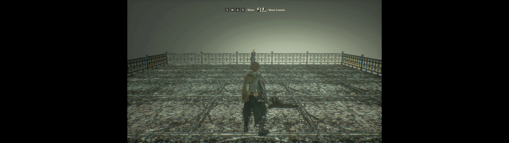

# Code Vein Fix
***This project is designed exclusively for Windows due to its reliance on Windows-specific APIs. The build process requires the use of PowerShell.***

## Features
- Removes pillarbox
- Corrects FOV

## Build and Install
### Using CMake
1. Build and install:
```ps1
git clone --recurse-submodules https://github.com/PolarWizard/CodeVeinFix
cd CodeVeinFix; mkdir build; cd build
cmake ..
cmake --build .
cmake --install .
```
`cmake ..` will attempt to find the game folder in `C:/Program Files (x86)/Steam/steamapps/common/`. If the game folder cannot be found rerun the command providing the path to the game folder:<br>`cmake .. -DGAME_FOLDER="<FULL-PATH-TO-GAME-FOLDER>"`

2. Download [winmm.dll](https://github.com/ThirteenAG/Ultimate-ASI-Loader/releases) x64 version
3. Extract to `CODE VEIN/CodeVein/Binaries/Win64`

## Configuration
- Adjust settings in `CODE VEIN/CodeVein/Binaries/Win64/scripts/CodeVeinFix.yml`

## Screenshots


## License
Distributed under the MIT License. See [LICENSE](LICENSE) for more information.

## External Tools
- [Ultimate ASI Loader](https://github.com/ThirteenAG/Ultimate-ASI-Loader)
- [spdlog](https://github.com/gabime/spdlog)
- [yaml-cpp](https://github.com/jbeder/yaml-cpp)
